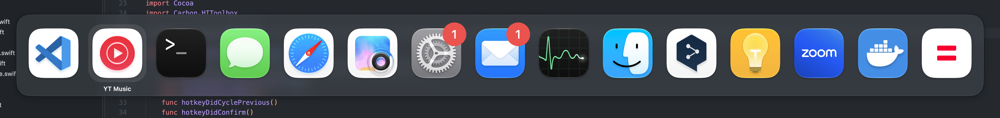
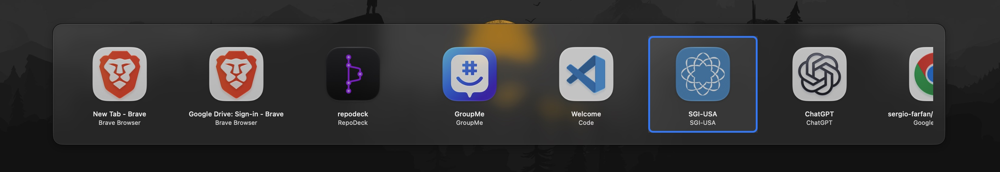
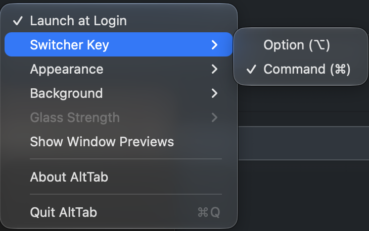
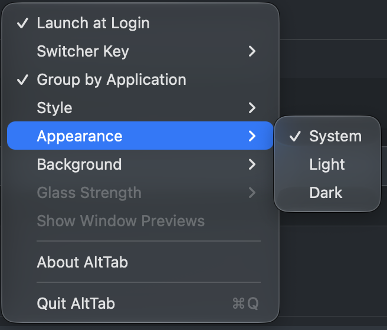
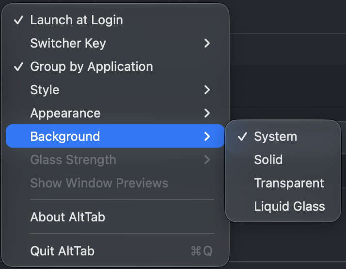

<p align="center">
  
  
  
  
  
  
</p>

# AltTab

**Windows-style window switcher for macOS.**

<!--
  DEMO GIF: record a ~5s screen capture of Option-Tab cycling through window
  thumbnails, save it as Screenshots/demo.gif, then replace the  below with:
    
-->
<p align="center">
  
</p>
<p align="center">
  <em>The default look: one icon per app with its Dock badge, most-recent first, on the screen where your mouse is — and with Switcher Key → Command it answers Cmd-Tab.</em>
</p>

macOS Cmd-Tab switches between *applications*. AltTab switches between *windows* — just like Alt-Tab on Windows. Hold Option, tap Tab to see every open window as a thumbnail, cycle through them, and release to switch. Prefer it on the system shortcut? Set **Switcher Key → Command** in the menu and Cmd-Tab becomes a window switcher.

## Download

**[Download the latest AltTab.dmg →](https://github.com/sergio-farfan/alttab-macos/releases/latest)**

Open the `.dmg`, drag **AltTab** to **Applications**, and launch it. Grant **Accessibility** when prompted (System Settings → Privacy & Security → Accessibility).

<!-- UNSIGNED-NOTE: remove this block once notarized builds ship. -->
> This build is not yet notarized. On first launch macOS blocks it: open **System Settings → Privacy & Security**, click **Open Anyway**, and launch again (or clear the quarantine flag with `xattr -dr com.apple.quarantine /Applications/AltTab.app`).

**Homebrew**:

```bash
brew install --cask sergio-farfan/tap/alttab
```

The fully qualified name trusts just this cask (Homebrew 6+ requires third-party taps to be trusted before their code runs). To use the short name instead, run `brew trust sergio-farfan/tap && brew tap sergio-farfan/tap` first, then `brew install --cask alttab`. Update later with `brew upgrade --cask alttab` — until releases are notarized, each upgrade of this ad-hoc-signed build needs the **Open Anyway** step once more (Homebrew only carries a Gatekeeper approval forward when the signing identity is stable).

Prefer to build it yourself? See [Build from source](#build-from-source).

## Why another AltTab?

[`lwouis/alttab`](https://github.com/lwouis/alttab) is the feature-rich, highly configurable incumbent. This project is the deliberately minimal alternative:

- **Tiny and auditable** — ~2,700 lines of pure Swift + AppKit, single purpose.
- **Zero dependencies** — no packages, no frameworks bundled.
- **No Screen Recording permission** — titles via the Accessibility API, app icons instead of live thumbnails (avoids the recurring macOS 15 recording prompt). Live window previews are available as a strictly opt-in toggle on macOS 14+.
- **Windows-style Option-Tab** semantics with menu-bar-only footprint (no Dock icon).

If you want extensive customization, use lwouis/alttab. If you want something small you can read end to end, use this.

## Features

- **Option-Tab** to activate, cycle with Tab, confirm on release
- **Switcher Key** setting: Option (default) or **Command** — Command takes over the system Cmd-Tab app switcher while AltTab runs, no system settings changes needed; while the switcher is open, **Q** quits and **H** hides the selected window's app (native Cmd-Tab convention, works in both modes)
- **Group by Application** (default on): one entry per app (its most recent window), ordered by latest use — exactly the system switcher's list, but MRU-accurate. Move between an app's windows with its own Cmd-`. Turn it off for one entry per window; **Thumbnails** style brings back the original preview cells
- **Dock Click Opens Recent Window** (default on): clicking a running app in the Dock brings forward only its most recent window — the same one the switcher would raise — instead of all of its windows. Hold, drag and modifier clicks still go to the Dock
- **Style**: **Icons** (default) — the native look: app icons at the system switcher's size and spacing, shrinking as the list grows so the whole row fits the screen (down to a floor, then it scrolls), a filled highlight behind the selection, Dock badges (unread counts) on the icons, and the selected app's name beneath it, never truncated. Or **Thumbnails** — the original cells with a window preview or icon, title and app name. Icons style never captures previews, so it never asks for Screen Recording
- **Shift-Tab** / Arrow keys to navigate in reverse — and **Option-Shift-Tab** opens the switcher already cycling backward, anchored on the least-recently-used window (new in 1.3.2)
- **Escape** to cancel without switching
- **Instant response** — the window list is kept warm by a debounced background refresh between invocations, window-raise runs off the main thread, and app icons are cached, so the switcher appears immediately with fresh contents even after hours of idle (1.3.2)
- Window titles via Accessibility API — works for all apps without Screen Recording permission
- App icon display with graceful fallback (no Screen Recording prompt on macOS 15+)
- Includes minimized windows, ⌘H-hidden apps, and windows on other Spaces
- Optional live window previews (ScreenCaptureKit, macOS 14+, opt-in from the menu)
- Appearance override (System / Light / Dark) and background styles: **System** (default — whatever the Dock's own switcher uses on your OS: Liquid Glass on 26+, the HUD material before), Solid (opaque, WCAG AA-tested label contrast), Transparent, or native Liquid Glass (macOS 26+) with a **Glass Strength** setting — Light / Medium / High / Max. Out of the box the switcher looks like the built-in Cmd-Tab; set Switcher Key to Command and it replaces it
- Multi-monitor aware — the switcher opens on the screen with the mouse pointer
- MRU (most recently used) ordering with intra-app focus tracking — resilient to busy apps: a wedged app's Accessibility timeout can't drop its windows from the list or scramble their order (1.3.2)
- Menu bar utility — no Dock icon, no clutter
- Launch at Login support (macOS 13+ SMAppService)
- Zero dependencies — pure Swift + AppKit
- ~3,000 lines of code, single-purpose, auditable (138 unit tests on the pure-logic core, run in CI)

## The switcher

Press the switcher key + Tab and hold. The panel opens on the screen with the mouse pointer and lists what you can switch to, **most recently used first** — the app you are in sits first, the one you were in before it is already selected, so a single Tab and release flips between your two most recent apps, exactly like the system switcher. Keep tapping Tab (or use the arrow keys, Shift-Tab to go back) to move along; release the modifier to switch. Escape cancels.

### Icons style (default)

<p align="center">
  
</p>

- **One entry per app** (Group by Application, on by default), represented by the app's most recent window. Confirming activates the app and raises that window; move between an app's own windows with the app's usual Cmd-` afterwards.
- **Native geometry.** Icon size, the gap between icons, the highlight behind the selection, the panel's padding and even the caption's distance were measured against the Dock's own switcher, so the two are hard to tell apart side by side. As more apps open, the icons shrink to keep the whole row on screen; past a floor the row scrolls.
- **The selected app's name** floats under its icon at full width — long names are never cut to the icon's width.
- **Dock badges.** Unread counts and dots appear at the icon's corner, read from the Dock when the switcher opens. No extra permission: the Accessibility grant the app already has covers it.
- **Q and H** while the switcher is open quit or hide the selected app and keep the switcher up, as in the system switcher. Every other key is swallowed while the panel is up, so a held Command can't fire a stray Cmd-Q or Cmd-W at the app behind it.
- **No Screen Recording, ever.** Icons style never captures window previews.

### Thumbnails style (the original look)

<p align="center">
  
</p>

The look AltTab shipped with — one cell per **window**, with a preview (or the app icon), the window title and the app name. To get it back:

1. **Style → Thumbnails** in the menu.
2. Turn **Group by Application** off, so each window gets its own cell instead of one per app.
3. Optionally **Show Window Previews** for live captures instead of icons (macOS 14+). This is the one feature that asks for Screen Recording; with it off, the app never touches that API.

Everything else — the key table, MRU order, Q/H, Escape — is the same in both styles.

### Group by Application

AltTab tracks windows, not apps: its order is a most-recently-used list of every window, kept current by focus tracking. **Group by Application** (on by default) folds that list so each app appears once:

- **What you see.** One entry per app, standing for the app's most recently used window. Apps are ordered by when you last used any of their windows, so the list reads exactly like the system switcher's — but driven by real focus history rather than app activation order. An app whose windows are all minimized or hidden is still listed; an app with no windows at all is not (the system switcher shows those too — that is the one difference).
- **What confirming does.** Activates the app and raises that most recent window — un-minimizing it or pulling it in from another Space if needed. To move between the app's own windows afterwards, use the app's usual <kbd>Cmd</kbd> + <kbd>`</kbd>, which AltTab never intercepts.
- **Q and H** act on the whole app: quit it, or hide it, and the switcher stays up.
- **Selection.** The first Tab always lands on the *previous* app, even if the window you are in isn't its app's most recent one in the cache — the anchor maps your focused window onto its app's entry.

Turn it **off** and every window gets its own entry again, in either style: the list then shows several entries for an app with several windows, each activating that specific window. With Icons style that means repeated icons told apart by the caption (the window title); Thumbnails style shows each window's preview and title.

### Dock click

The Dock does the opposite of the switcher: clicking an app's icon brings *every* window of that app forward. **Dock Click Opens Recent Window** (on by default) makes a Dock click behave like confirming the app in the switcher — only its most recently used window comes forward, un-minimized or pulled in from another Space if needed.

- **What is taken over.** A plain left click, pressed and released quickly, on the Dock icon of a running app that has windows AltTab knows about, when that app isn't already frontmost.
- **What still goes to the Dock.** Everything else, exactly as before: press-and-hold (the Dock menu), dragging a file onto an icon, <kbd>Cmd</kbd> / <kbd>Option</kbd> / <kbd>Control</kbd> / <kbd>Shift</kbd> clicks, right clicks, folders, the Trash, apps that aren't running or have no windows (the Dock launches or reopens them), and clicks on the frontmost app — so the Dock's own "Minimize windows on application icon click" setting keeps working.
- **How.** A second event tap, active only while the setting is on and only for mouse events, holds the press while the Dock's Accessibility tree is asked what sits under the pointer (off the main thread); a quick release raises the window, anything else replays the held events to the Dock. If the Dock takes longer than 300 ms to answer, the click is handed back and behaves natively — a click is never lost. No extra permission: the Accessibility grant AltTab already has covers the Dock.

## Settings

Everything lives in the menu bar item; there is no preferences window. Changes apply to the next invocation, no relaunch.

<p align="center">
  
  
  
</p>

| Item | What it does | Default |
|------|--------------|---------|
| **Launch at Login** | Registers AltTab as a login item (macOS 13+ `SMAppService`). | off |
| **Switcher Key** | **Option** keeps the system Cmd-Tab untouched. **Command** makes Cmd-Tab open AltTab instead of the system app switcher — the event tap swallows the keystroke before the Dock sees it, so nothing changes in System Settings and the system switcher is back the moment AltTab quits. | Option |
| **Group by Application** | One entry per app (its most recent window) instead of one per window. | on |
| **Dock Click Opens Recent Window** | A plain click on a running app's Dock icon raises only its most recent window, like the switcher does, instead of all of its windows. Hold, drag, modifier clicks, the frontmost app and apps without windows go to the Dock as usual. | on |
| **Style** | **Icons** — the native look described above — or **Thumbnails**, the original window cells. | Icons |
| **Appearance** | Panel theme: follow the **System**, or force **Light** / **Dark**. | System |
| **Background** | **System** draws what the Dock's switcher uses on your OS: Liquid Glass at Apple's default on macOS 26+, the translucent HUD material before — so Appearance and Accessibility settings (Reduce Transparency, tinted vs. clear glass) apply as-is. **Solid** is an opaque plate with WCAG AA-tested label contrast, **Transparent** the classic HUD, **Liquid Glass** an explicit glass you can tune. | System |
| **Glass Strength** | Light / Medium / High / Max for an explicit Liquid Glass background; greyed out otherwise (under System the OS decides). | High |
| **Show Window Previews** | Live window captures in Thumbnails style (ScreenCaptureKit, macOS 14+). The only setting that requests Screen Recording; greyed out under Icons, which has no preview area. | off |
| **About AltTab** / **Quit AltTab** | Version, and quit (⌘Q). | |

## Build from source

```bash
git clone https://github.com/sergio-farfan/alttab-macos.git
cd alttab-macos
./build.sh install
open ~/Applications/AltTab.app
```

Then grant **Accessibility** permission when prompted (System Settings → Privacy & Security → Accessibility).

## Prerequisites

| Requirement | Details |
|-------------|---------|
| **macOS** | 13.0+ (Ventura or newer) to run |
| **Xcode** | 26 or newer to build from source (the code references `NSGlassEffectView`, which only exists in the macOS 26 SDK); full install from App Store, not just Command Line Tools |

<details>
<summary>First time with Xcode?</summary>

If you just installed Xcode, you may need to run:

```bash
sudo xcode-select -s /Applications/Xcode.app/Contents/Developer
sudo xcodebuild -license accept
sudo xcodebuild -runFirstLaunch
```
</details>

## Install

### User install (recommended)

Installs to `~/Applications` — no sudo required.

```bash
./build.sh install
```

### System-wide install

Installs to `/Applications` — requires sudo.

```bash
sudo ./build.sh install --system
```

### Build commands

| Command | Description |
|---------|-------------|
| `./build.sh build` | Build only (Release configuration) |
| `./build.sh install` | Build and install to `~/Applications` |
| `./build.sh install --system` | Build and install to `/Applications` (sudo) |
| `./build.sh run` | Build and launch from build directory |
| `./build.sh clean` | Remove build artifacts |
| `./build.sh uninstall` | Remove from `~/Applications` |
| `./build.sh uninstall --system` | Remove from `/Applications` (sudo) |

## Permissions

On first launch, AltTab will prompt for Accessibility access. Screen Recording is optional.

| Permission | Required | Why |
|-----------|----------|-----|
| **Accessibility** | Yes | CGEvent tap for global hotkey detection; AXUIElement for window titles, window management, focus tracking, and unminimize |
| **Screen Recording** | No (opt-in) | Only for the optional "Show Window Previews" feature (macOS 14+, ScreenCaptureKit) |

Grant in: **System Settings → Privacy & Security → Accessibility**

> **Note:** Screen Recording permission is **not required**. Window titles are read via the Accessibility API, and app icons are used instead of live thumbnails. This avoids the repeated "Screen & System Audio Recording" prompt on macOS 15 (Sequoia). Enabling **Show Window Previews** in the status menu is the only thing that requests Screen Recording; with the toggle off (the default) the API is never touched.

### Option-Tab stops working after an update

macOS pins each Accessibility grant to the code identity of one specific build. Ad-hoc-signed releases get a new identity every build, so after updating AltTab the toggle in System Settings still shows **ON** while the new binary is silently denied. Fix:

```bash
tccutil reset Accessibility com.alttab.app
open ~/Applications/AltTab.app   # or /Applications — grant again when prompted
```

(Equivalently: remove AltTab from the Accessibility list with the **−** button and re-add it.) This re-prompt-per-update goes away once releases are signed with a stable Developer ID certificate.

## Usage

| Shortcut | Action |
|----------|--------|
| <kbd>Option</kbd> + <kbd>Tab</kbd> | Open switcher, select next window (<kbd>Cmd</kbd> instead of <kbd>Option</kbd> when Switcher Key is Command) |
| <kbd>Option</kbd> + <kbd>Shift</kbd> + <kbd>Tab</kbd> | Open switcher cycling backward (least-recent window first) |
| <kbd>Tab</kbd> | Cycle forward (while holding Option) |
| <kbd>Q</kbd> | Quit the selected window's app, keep switching |
| <kbd>H</kbd> | Hide the selected window's app, keep switching |
| <kbd>Shift</kbd> + <kbd>Tab</kbd> | Cycle backward |
| <kbd>←</kbd> <kbd>→</kbd> | Navigate left / right |
| Release <kbd>Option</kbd> | Switch to selected window |
| <kbd>Escape</kbd> | Cancel, dismiss switcher |
| <kbd>Enter</kbd> | Confirm selection |
| Click thumbnail | Select and switch |

## How It Works

AltTab installs a **CGEvent tap** at the session level to intercept keyboard events globally. A 3-state machine (idle → active → idle) tracks modifier hold/release and Tab presses (the modifier is Option or Command per the Switcher Key setting; in Command mode the head-inserted session tap swallows the Cmd-Tab keyDown before the Dock's app switcher sees it). While the switcher is open every other keyDown is swallowed too, so a chord like Cmd-W can't leak to the frontmost app. The event tap includes retry logic with exponential backoff to handle the case where the Accessibility subsystem isn't ready at login time. Window enumeration combines `CGWindowListCopyWindowInfo` (on-screen windows) with `AXUIElement` queries (minimized windows). Window titles are read via `AXUIElement` (`kAXTitleAttribute`), which only requires Accessibility permission — no Screen Recording needed. MRU order is maintained via `NSWorkspace` activation notifications and per-app `AXObserver` callbacks that track focused-window changes — including intra-app switches like Cmd-\`. Between invocations, those same events schedule a debounced, rate-limited background re-gather, so the cached window list the switcher opens from is never stale — even on the first Option-Tab after hours of idle.

The switcher UI is a **non-activating NSPanel** (`.nonactivatingPanel` style mask) so it floats above all windows without stealing focus. App icons are displayed for each window, served from an in-memory cache (prewarmed at launch) so the panel paints immediately instead of resolving each icon through LaunchServices on the fly. Window activation uses `AXUIElement` to raise the specific window and unminimize if needed; that synchronous AX IPC runs on a background queue with a bounded messaging timeout, so a slow target app can't block the main thread (and stall the switcher).

## Architecture

```
AltTab/AltTab/
├── main.swift                  # App entry point — wires NSApp delegate manually
├── AppDelegate.swift           # Lifecycle, menu bar status item, orchestration, session epochs
├── HotkeyManager.swift         # CGEvent tap plumbing; decodes events for the state machine
├── SwitcherStateMachine.swift  # Pure modifier-Tab session state machine + SwitcherModifier setting (unit-tested)
├── SwitcherSelection.swift     # Pure per-session selection: initial anchor, cycling, reconcile (unit-tested)
├── WindowModel.swift           # CGWindowList + concurrent AX pass per app, warm cache + async refresh
├── MRUOrder.swift              # Pure MRU ordering (unit-tested)
├── GatherMerge.swift           # Pure carry-over policy for lossy AX gathers (unit-tested)
├── Debouncer.swift             # Trailing-edge debouncer for the background cache refresh (unit-tested)
├── WindowCapture.swift         # Opt-in ScreenCaptureKit window previews (macOS 14+)
├── SwitcherPresentation.swift  # Pure Style (Thumbnails / Icons) metrics + Group-by-Application collapse (unit-tested)
├── SwitcherPanel.swift         # NSPanel overlay with selectable background (solid / HUD / Liquid Glass / System)
├── ThumbnailView.swift         # Individual window cell (preview/icon + title + app name)
├── WindowActivator.swift       # AXUIElement window raise / unminimize (off-main, bounded timeout)
├── PermissionManager.swift     # Accessibility polling; Screen Recording preflight/request
└── PreferencesMenu.swift       # Status bar menu (Launch at Login, Switcher Key, Group by Application, Style, Appearance, Background, Glass Strength, Window Previews, Quit)
```

## Uninstall

```bash
./build.sh uninstall                # Remove from ~/Applications
sudo ./build.sh uninstall --system  # Remove from /Applications
```

Or manually delete `AltTab.app` and remove from Login Items in System Settings.

## Contributing

1. Fork the repo
2. Create a feature branch (`git checkout -b feature/my-feature`)
3. Make your changes
4. Test: `./build.sh run`
5. Commit and push
6. Open a Pull Request

## License

[MIT](LICENSE) — Sergio Farfan (sergio.farfan@gmail.com)
